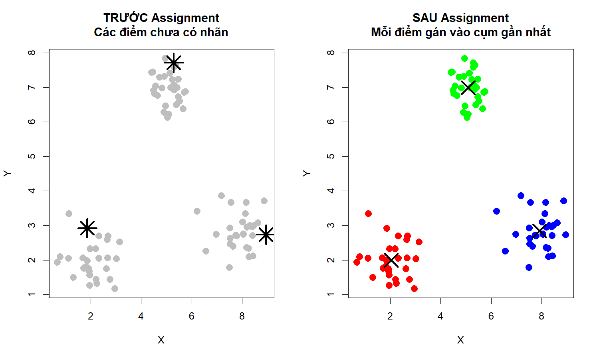
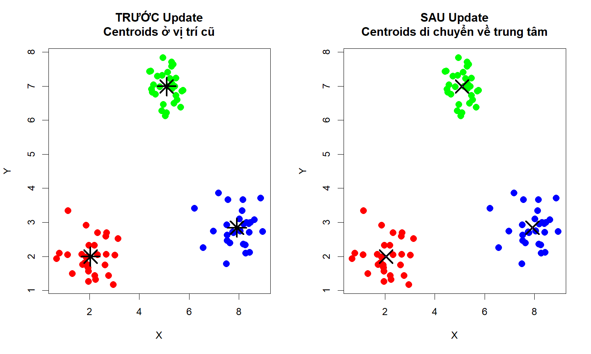
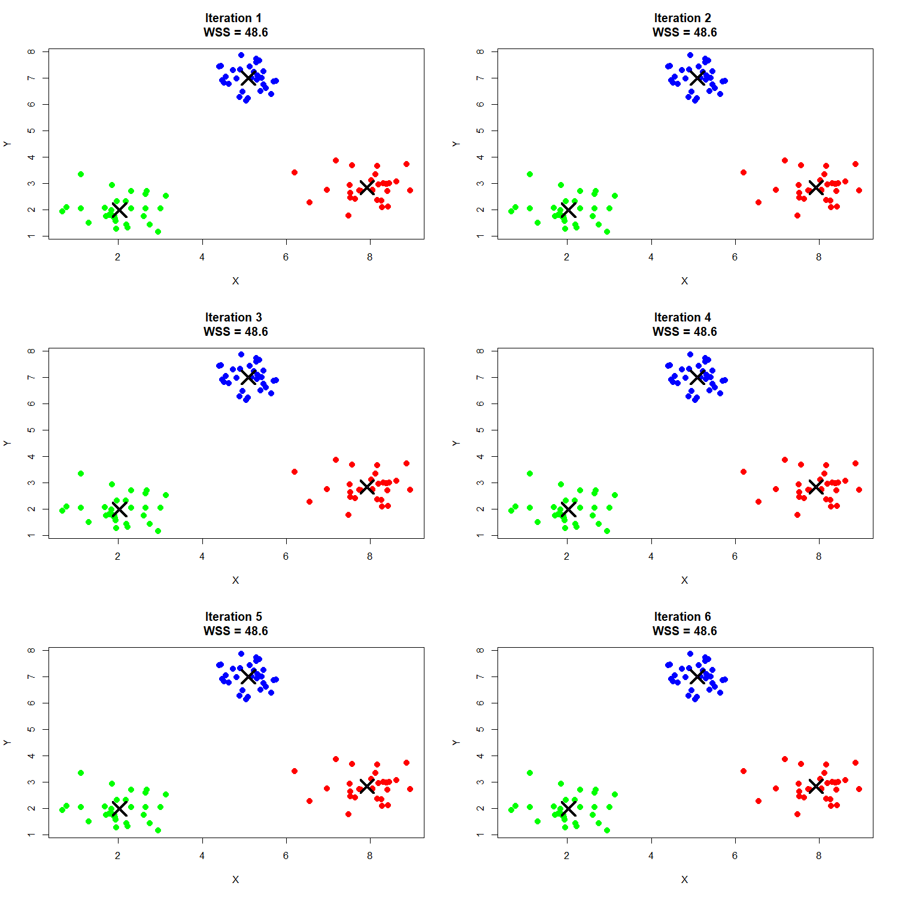
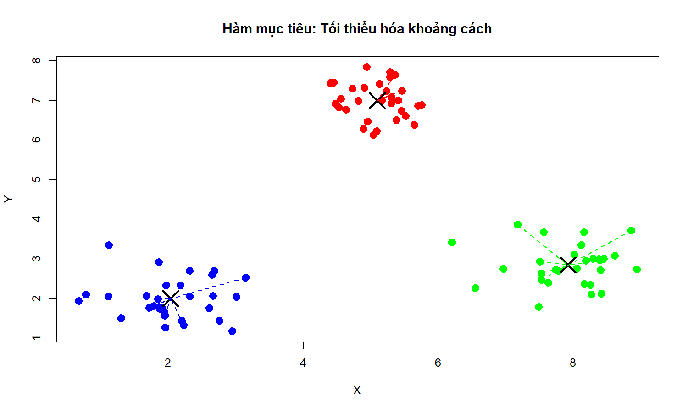
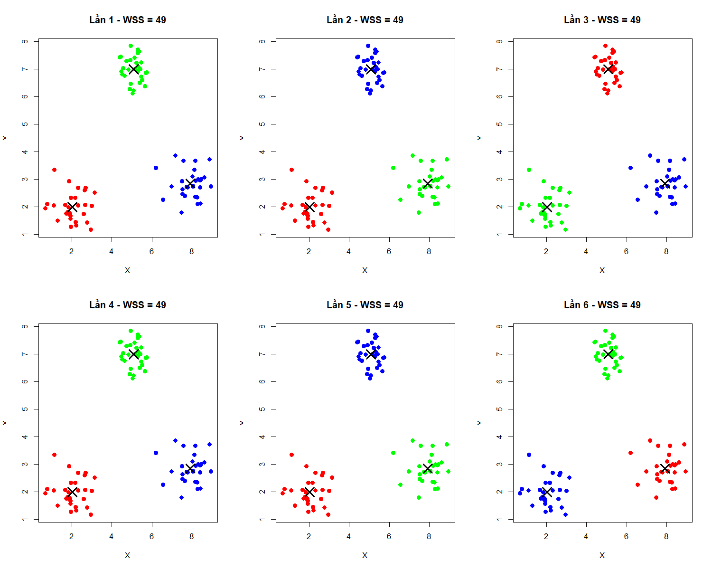
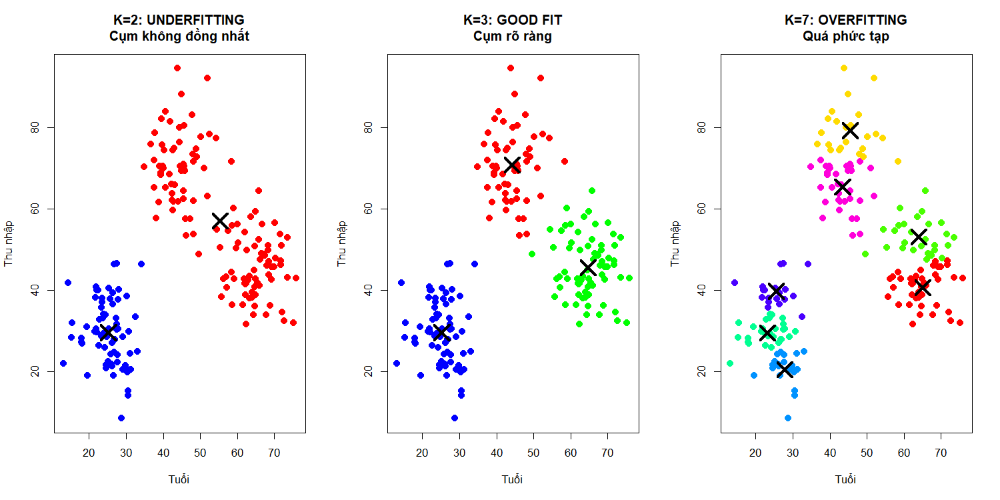
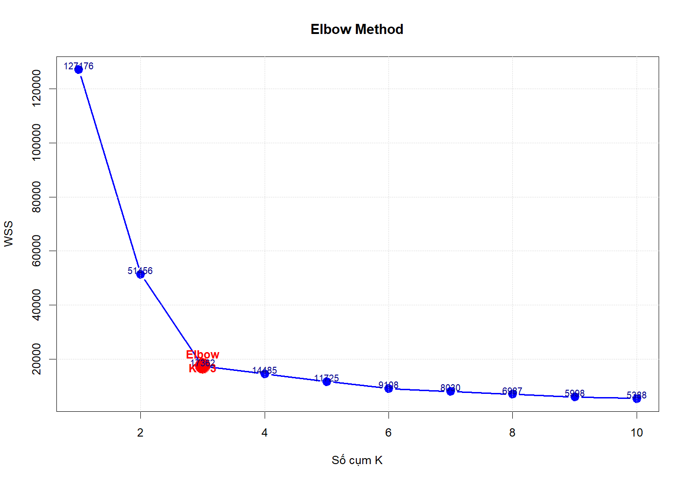
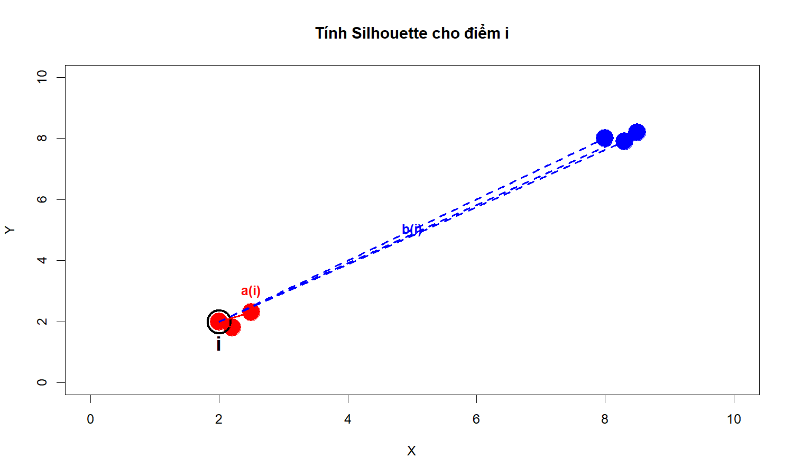
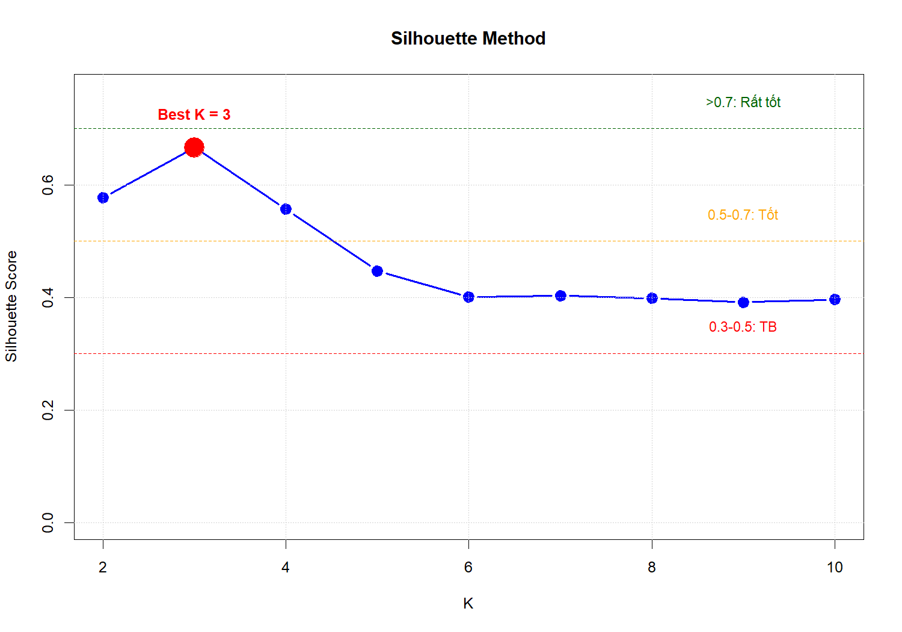
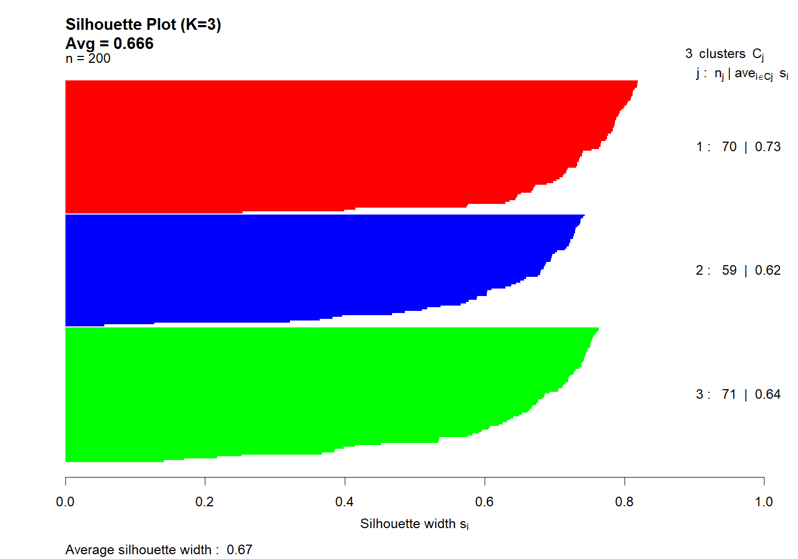

Bài 2: Unsupervised Learning - Phân cụm (Clustering)
================
Giảng viên: Lê Nhật Tùng
Tháng 3, 2026

## Mục tiêu học tập

Sau khi hoàn thành bài học này, sinh viên có thể:

- Hiểu Unsupervised Learning và vai trò của Clustering
- Nắm vững thuật toán K-Means và cách hoạt động từng bước
- Biết cách chọn K tối ưu (Elbow Method và Silhouette Method)
- Hiểu và áp dụng Hierarchical Clustering
- Sử dụng DBSCAN cho dữ liệu phức tạp
- Đánh giá chất lượng clustering
- Áp dụng vào bài toán thực tế

------------------------------------------------------------------------

## 2.1 Unsupervised Learning là gì?

### 2.1.1 Định nghĩa

**Unsupervised Learning (Học không giám sát)** là học từ dữ liệu **KHÔNG
có nhãn**.

**Đặc điểm:**

- Chỉ có **input (X)**, không có output (y)
- Mục tiêu: Tìm **cấu trúc ẩn** trong dữ liệu
- Không có “đáp án đúng” để so sánh

### 2.1.2 So sánh với Supervised Learning

| Khía cạnh    | Supervised Learning           | Unsupervised Learning        |
|--------------|-------------------------------|------------------------------|
| **Dữ liệu**  | Có nhãn (X, y)                | Không nhãn (X)               |
| **Mục tiêu** | Dự đoán y từ X                | Tìm patterns, cấu trúc       |
| **Ví dụ**    | Phân loại spam, Dự đoán giá   | Phân nhóm khách hàng         |
| **Đánh giá** | Accuracy, F1, RMSE            | Silhouette, Elbow, Inertia   |
| **Độ khó**   | Dễ đánh giá (có ground truth) | Khó đánh giá (không có nhãn) |

### 2.1.3 Các loại Unsupervised Learning

<!-- -->

**1. Clustering (Phân cụm)**

- Nhóm các đối tượng tương tự vào cùng một cụm
- Thuật toán: K-Means, Hierarchical, DBSCAN
- Ứng dụng: Phân khúc khách hàng, nhóm tin tức

**2. Dimensionality Reduction (Giảm chiều)**

- Giảm số lượng features, giữ lại thông tin quan trọng
- Thuật toán: PCA, t-SNE, UMAP
- Ứng dụng: Visualization, nén dữ liệu, feature extraction

**3. Association Rules (Luật kết hợp)**

- Tìm mối quan hệ giữa các items
- Thuật toán: Apriori, FP-Growth
- Ứng dụng: Market Basket Analysis (mua bia thường mua tã)

**4. Anomaly Detection (Phát hiện bất thường)**

- Tìm các điểm dữ liệu khác biệt
- Ứng dụng: Phát hiện gian lận, lỗi hệ thống

------------------------------------------------------------------------

## 2.2 Clustering là gì?

### 2.2.1 Định nghĩa

**Clustering (Phân cụm)** là nhóm các đối tượng **tương tự** vào cùng
một cụm.

**Mục tiêu:**

- Các đối tượng **trong cùng cụm** có độ tương đồng cao
- Các đối tượng **khác cụm** có độ khác biệt cao

### 2.2.2 Ví dụ trực quan

``` r
set.seed(123)

# Tạo 3 nhóm dữ liệu rõ ràng
group1 <- data.frame(x = rnorm(50, 2, 0.5), y = rnorm(50, 2, 0.5))
group2 <- data.frame(x = rnorm(50, 8, 0.6), y = rnorm(50, 3, 0.6))
group3 <- data.frame(x = rnorm(50, 5, 0.5), y = rnorm(50, 7, 0.5))

all_data <- rbind(group1, group2, group3)
true_labels <- c(rep(1, 50), rep(2, 50), rep(3, 50))

par(mfrow = c(1, 2))

# Trước clustering
plot(all_data$x, all_data$y, pch = 19, col = "gray", cex = 1.2,
     xlab = "Feature 1", ylab = "Feature 2",
     main = "TRƯỚC clustering\n(Không có nhãn)")

# Sau clustering
plot(all_data$x, all_data$y, pch = 19, cex = 1.2,
     col = c("red", "blue", "green")[true_labels],
     xlab = "Feature 1", ylab = "Feature 2",
     main = "SAU clustering\n(Máy tự tìm 3 nhóm)")

legend("topright", legend = c("Cụm 1", "Cụm 2", "Cụm 3"),
       col = c("red", "blue", "green"), pch = 19, cex = 0.9)
```

<!-- -->

``` r
par(mfrow = c(1, 1))
```

### 2.2.3 Ứng dụng thực tế

| Lĩnh vực | Ứng dụng | Mục đích |
|----|----|----|
| **Marketing** | Phân khúc khách hàng | Chiến lược marketing riêng cho từng nhóm |
| **E-commerce** | Gợi ý sản phẩm | Tăng doanh thu, cross-sell |
| **Y tế** | Phân nhóm bệnh nhân | Điều trị cá nhân hóa |
| **Sinh học** | Phân loại gen | Nghiên cứu di truyền |
| **Xử lý ảnh** | Phân đoạn ảnh | Computer Vision, object detection |
| **Mạng xã hội** | Phát hiện cộng đồng | Phân tích mạng lưới |
| **Tài chính** | Phát hiện gian lận | Nhóm giao dịch bất thường |

**Ví dụ cụ thể: Phân khúc khách hàng**

``` r
set.seed(42)

# Tạo dữ liệu khách hàng
customers <- data.frame(
  Age = c(rnorm(70, 25, 4), rnorm(60, 45, 5), rnorm(70, 65, 6)),
  Income = c(rnorm(70, 30, 8), rnorm(60, 70, 10), rnorm(70, 45, 8)),
  Spending = c(rnorm(70, 20, 5), rnorm(60, 80, 12), rnorm(70, 40, 8))
)

# K-Means
km <- kmeans(customers, centers = 3, nstart = 25)
customers$Cluster <- km$cluster

# Visualization
par(mfrow = c(1, 2))

plot(customers$Age, customers$Income,
     col = c("red", "blue", "green")[customers$Cluster],
     pch = 19, cex = 1.3,
     xlab = "Tuổi", ylab = "Thu nhập (triệu/tháng)",
     main = "Age vs Income")
points(km$centers[, 1:2], pch = 4, cex = 3, lwd = 3)

plot(customers$Income, customers$Spending,
     col = c("red", "blue", "green")[customers$Cluster],
     pch = 19, cex = 1.3,
     xlab = "Thu nhập", ylab = "Chi tiêu",
     main = "Income vs Spending")
points(km$centers[, 2:3], pch = 4, cex = 3, lwd = 3)
```

<!-- -->

``` r
par(mfrow = c(1, 1))
```

**Phân tích 3 nhóm khách hàng:**

``` r
# Thống kê từng cụm
cluster_summary <- data.frame(
  Cum = 1:3,
  So_luong = as.numeric(table(customers$Cluster)),
  Tuoi_TB = tapply(customers$Age, customers$Cluster, mean),
  Thu_nhap_TB = tapply(customers$Income, customers$Cluster, mean),
  Chi_tieu_TB = tapply(customers$Spending, customers$Cluster, mean)
)

# Làm tròn
cluster_summary[, 3:5] <- round(cluster_summary[, 3:5], 1)

cluster_summary
```

    ##   Cum So_luong Tuoi_TB Thu_nhap_TB Chi_tieu_TB
    ## 1   1       71    64.6        45.6        39.7
    ## 2   2       59    44.3        70.7        79.6
    ## 3   3       70    25.2        29.5        19.8

**Đặc điểm và chiến lược:**

- **Cụm 1**: Trẻ, thu nhập thấp, chi tiêu thấp
  - Chiến lược: Sản phẩm giá rẻ, khuyến mãi mạnh
- **Cụm 2**: Trung niên, thu nhập cao, chi tiêu cao
  - Chiến lược: Sản phẩm cao cấp, chương trình VIP
- **Cụm 3**: Cao tuổi, thu nhập trung bình, chi tiêu vừa phải
  - Chiến lược: Sản phẩm chất lượng, dịch vụ tốt

------------------------------------------------------------------------

## 2.3 K-Means Clustering

### 2.3.1 Hiểu thuật toán K-Means từ đầu

**K-Means là gì?**

K-Means là thuật toán phân cụm dựa trên **khoảng cách**. Mục tiêu là
chia N điểm dữ liệu thành K cụm, sao cho:

- Các điểm **trong cùng cụm** gần nhau nhất (homogeneous)
- Các điểm **khác cụm** xa nhau nhất (well-separated)

**Tên gọi:**

- **K**: Số cụm (phải chọn trước)
- **Means**: Trung bình (centroid là điểm trung bình)

### 2.3.2 Các bước thuật toán chi tiết

**Bước 0: Chuẩn bị**

- Input: Dữ liệu X với N điểm, số cụm K
- Output: Gán nhãn cụm cho mỗi điểm

**Bước 1: Khởi tạo (Initialization)**

Chọn K centroids (tâm cụm) ban đầu. Có 3 cách phổ biến:

1.  **Random** - Chọn ngẫu nhiên K điểm làm centroids
2.  **K-Means++** - Chọn thông minh để centroids xa nhau
3.  **Random Partition** - Gán ngẫu nhiên, rồi tính centroids

``` r
set.seed(42)

# Tạo dữ liệu mẫu
data_points <- data.frame(
  x = c(rnorm(30, 2, 0.5), rnorm(30, 8, 0.6), rnorm(30, 5, 0.5)),
  y = c(rnorm(30, 2, 0.5), rnorm(30, 3, 0.6), rnorm(30, 7, 0.5))
)

par(mfrow = c(1, 3))

# Cách 1: Random
set.seed(123)
random_idx <- sample(1:nrow(data_points), 3)
plot(data_points$x, data_points$y, pch = 19, col = "gray", cex = 1.2,
     main = "Cách 1: Random\nChọn ngẫu nhiên 3 điểm",
     xlab = "X", ylab = "Y")
points(data_points$x[random_idx], data_points$y[random_idx], 
       pch = 8, cex = 3, lwd = 3, col = "red")
text(data_points$x[random_idx], data_points$y[random_idx] + 0.5, 
     labels = c("C1", "C2", "C3"), col = "red", font = 2)

# Cách 2: K-Means++ (mô phỏng - chọn xa nhau)
c1_idx <- sample(1:nrow(data_points), 1)
dist_to_c1 <- sqrt((data_points$x - data_points$x[c1_idx])^2 + 
                   (data_points$y - data_points$y[c1_idx])^2)
c2_idx <- which.max(dist_to_c1)
dist_to_c2 <- sqrt((data_points$x - data_points$x[c2_idx])^2 + 
                   (data_points$y - data_points$y[c2_idx])^2)
min_dist <- pmin(dist_to_c1, dist_to_c2)
c3_idx <- which.max(min_dist)
kmpp_idx <- c(c1_idx, c2_idx, c3_idx)

plot(data_points$x, data_points$y, pch = 19, col = "gray", cex = 1.2,
     main = "Cách 2: K-Means++\nChọn thông minh (xa nhau)",
     xlab = "X", ylab = "Y")
points(data_points$x[kmpp_idx], data_points$y[kmpp_idx], 
       pch = 8, cex = 3, lwd = 3, col = "blue")
text(data_points$x[kmpp_idx], data_points$y[kmpp_idx] + 0.5, 
     labels = c("C1", "C2", "C3"), col = "blue", font = 2)

# Cách 3: Random Partition
set.seed(456)
random_clusters <- sample(1:3, nrow(data_points), replace = TRUE)
centers_rp <- aggregate(data_points, by = list(random_clusters), mean)[, -1]

plot(data_points$x, data_points$y, pch = 19, col = "gray", cex = 1.2,
     main = "Cách 3: Random Partition\nGán ngẫu nhiên → Tính centroid",
     xlab = "X", ylab = "Y")
points(centers_rp$x, centers_rp$y, 
       pch = 8, cex = 3, lwd = 3, col = "green")
text(centers_rp$x, centers_rp$y + 0.5, 
     labels = c("C1", "C2", "C3"), col = "green", font = 2)
```

<!-- -->

``` r
par(mfrow = c(1, 1))
```

**Bước 2: Assignment (Gán cụm)**

Với mỗi điểm, tính khoảng cách đến **tất cả K centroids**, gán vào cụm
**gần nhất**.

**Công thức khoảng cách Euclidean:**

``` math
d(x, c) = \sqrt{(x_1 - c_1)^2 + (x_2 - c_2)^2 + ... + (x_n - c_n)^2}
```

**Ví dụ tính khoảng cách:**

``` r
# Giả sử có 1 điểm và 3 centroids
point <- c(x = 5, y = 5)
centroid1 <- c(x = 2, y = 2)
centroid2 <- c(x = 8, y = 3)
centroid3 <- c(x = 5, y = 7)

# Tính khoảng cách
d1 <- sqrt(sum((point - centroid1)^2))
d2 <- sqrt(sum((point - centroid2)^2))
d3 <- sqrt(sum((point - centroid3)^2))

# Kết quả
data.frame(
  Centroid = c("C1", "C2", "C3"),
  Toa_do = c("(2, 2)", "(8, 3)", "(5, 7)"),
  Khoang_cach = round(c(d1, d2, d3), 2),
  Gan_cum = c(ifelse(d1 == min(c(d1, d2, d3)), "✓", ""),
              ifelse(d2 == min(c(d1, d2, d3)), "✓", ""),
              ifelse(d3 == min(c(d1, d2, d3)), "✓", ""))
)
```

    ##   Centroid Toa_do Khoang_cach Gan_cum
    ## 1       C1 (2, 2)        4.24        
    ## 2       C2 (8, 3)        3.61        
    ## 3       C3 (5, 7)        2.00       ✓

**Giải thích:** Điểm (5, 5) gần C3 nhất → Gán vào Cụm 3

**Minh họa Assignment:**

``` r
# Sử dụng K-Means++ centroids
km_init <- kmeans(data_points, centers = data_points[kmpp_idx, ], 
                  algorithm = "Lloyd", iter.max = 1)

par(mfrow = c(1, 2))

# Trước assignment
plot(data_points$x, data_points$y, pch = 19, col = "gray", cex = 1.5,
     main = "TRƯỚC Assignment\nCác điểm chưa có nhãn",
     xlab = "X", ylab = "Y")
points(data_points$x[kmpp_idx], data_points$y[kmpp_idx], 
       pch = 8, cex = 3, lwd = 3, col = "black")

# Sau assignment
plot(data_points$x, data_points$y, pch = 19, cex = 1.5,
     col = c("red", "blue", "green")[km_init$cluster],
     main = "SAU Assignment\nMỗi điểm gán vào cụm gần nhất",
     xlab = "X", ylab = "Y")
points(km_init$centers[, 1], km_init$centers[, 2], 
       pch = 4, cex = 3, lwd = 3, col = "black")
```

<!-- -->

``` r
par(mfrow = c(1, 1))
```

**Bước 3: Update (Cập nhật centroids)**

Với mỗi cụm, tính **centroid mới** = trung bình tọa độ của tất cả điểm
trong cụm.

**Công thức:**

``` math
\mu_k = \frac{1}{|C_k|} \sum_{x \in C_k} x
```

Trong đó $`|C_k|`$ là số điểm trong cụm k.

**Ví dụ tính centroid:**

``` r
# Giả sử Cụm 1 có 3 điểm
cluster1_points <- data.frame(
  x = c(2.1, 2.5, 1.8),
  y = c(2.3, 1.9, 2.1)
)

cluster1_points
```

    ##     x   y
    ## 1 2.1 2.3
    ## 2 2.5 1.9
    ## 3 1.8 2.1

``` r
# Tính centroid mới
new_centroid <- colMeans(cluster1_points)

data.frame(
  Thanh_phan = c("μ_x", "μ_y"),
  Cong_thuc = c("(2.1 + 2.5 + 1.8) / 3", "(2.3 + 1.9 + 2.1) / 3"),
  Ket_qua = round(new_centroid, 2)
)
```

    ##   Thanh_phan             Cong_thuc Ket_qua
    ## x        μ_x (2.1 + 2.5 + 1.8) / 3    2.13
    ## y        μ_y (2.3 + 1.9 + 2.1) / 3    2.10

**Minh họa Update:**

``` r
par(mfrow = c(1, 2))

# Trước update (centroids cũ)
plot(data_points$x, data_points$y, pch = 19, cex = 1.5,
     col = c("red", "blue", "green")[km_init$cluster],
     main = "TRƯỚC Update\nCentroids ở vị trí cũ",
     xlab = "X", ylab = "Y")
points(km_init$centers[, 1], km_init$centers[, 2], 
       pch = 8, cex = 3, lwd = 3, col = "black")

# Sau update (centroids mới)
km_update <- kmeans(data_points, centers = data_points[kmpp_idx, ], 
                    algorithm = "Lloyd", iter.max = 2)

plot(data_points$x, data_points$y, pch = 19, cex = 1.5,
     col = c("red", "blue", "green")[km_update$cluster],
     main = "SAU Update\nCentroids di chuyển về trung tâm",
     xlab = "X", ylab = "Y")
points(km_update$centers[, 1], km_update$centers[, 2], 
       pch = 4, cex = 3, lwd = 3, col = "black")

# Vẽ mũi tên di chuyển
arrows(km_init$centers[, 1], km_init$centers[, 2],
       km_update$centers[, 1], km_update$centers[, 2],
       col = "purple", lwd = 2, length = 0.15)
```

<!-- -->

``` r
par(mfrow = c(1, 1))
```

**Bước 4: Lặp lại**

Lặp lại Bước 2-3 cho đến khi:

- Centroids không đổi (hội tụ), HOẶC
- Đạt số iteration tối đa

### 2.3.3 Minh họa đầy đủ quá trình K-Means

``` r
set.seed(42)

# Chạy từng iteration
iterations <- list()
current_centers <- data_points[sample(1:nrow(data_points), 3), ]

for (iter in 1:6) {
  km_iter <- kmeans(data_points, centers = current_centers, 
                    algorithm = "Lloyd", iter.max = 1)
  iterations[[iter]] <- km_iter
  current_centers <- km_iter$centers
}

# Vẽ 6 iterations
par(mfrow = c(3, 2))

for (i in 1:6) {
  plot(data_points$x, data_points$y, pch = 19, cex = 1.3,
       col = c("red", "blue", "green")[iterations[[i]]$cluster],
       main = paste("Iteration", i, 
                    "\nWSS =", round(iterations[[i]]$tot.withinss, 1)),
       xlab = "X", ylab = "Y")
  points(iterations[[i]]$centers[, 1], iterations[[i]]$centers[, 2], 
         pch = 4, cex = 3, lwd = 3, col = "black")
  
  # Vẽ mũi tên di chuyển (trừ iteration 1)
  if (i > 1) {
    arrows(iterations[[i-1]]$centers[, 1], 
           iterations[[i-1]]$centers[, 2],
           iterations[[i]]$centers[, 1], 
           iterations[[i]]$centers[, 2],
           col = "purple", lwd = 1.5, length = 0.1)
  }
}
```

<!-- -->

``` r
par(mfrow = c(1, 1))
```

**Quá trình hội tụ:**

``` r
data.frame(
  Iteration = 1:6,
  WSS = sapply(iterations, function(x) round(x$tot.withinss, 2))
)
```

    ##   Iteration   WSS
    ## 1         1 48.57
    ## 2         2 48.57
    ## 3         3 48.57
    ## 4         4 48.57
    ## 5         5 48.57
    ## 6         6 48.57

**Nhận xét:** WSS giảm dần và ổn định → Thuật toán hội tụ

### 2.3.4 Hàm mục tiêu của K-Means

**Mục tiêu:** Tối thiểu hóa tổng khoảng cách bình phương trong cụm (WSS)

``` math
J = \sum_{k=1}^{K} \sum_{x \in C_k} ||x - \mu_k||^2
```

Trong đó:

- K: Số cụm
- $`C_k`$: Cụm thứ k
- $`\mu_k`$: Centroid của cụm k
- $`||x - \mu_k||^2`$: Khoảng cách Euclidean bình phương

**Minh họa hàm mục tiêu:**

``` r
km_final <- kmeans(data_points, centers = 3, nstart = 25)

plot(data_points$x, data_points$y, pch = 19, cex = 1.5,
     col = c("red", "blue", "green")[km_final$cluster],
     main = "Hàm mục tiêu: Tối thiểu hóa khoảng cách",
     xlab = "X", ylab = "Y")
points(km_final$centers[, 1], km_final$centers[, 2], 
       pch = 4, cex = 3, lwd = 3, col = "black")

# Vẽ khoảng cách từ 15 điểm ngẫu nhiên
set.seed(789)
sample_pts <- sample(1:nrow(data_points), 15)
for (i in sample_pts) {
  cluster <- km_final$cluster[i]
  segments(data_points$x[i], data_points$y[i],
           km_final$centers[cluster, 1],
           km_final$centers[cluster, 2],
           col = c("red", "blue", "green")[cluster],
           lty = 2, lwd = 1.5)
}
```

<!-- -->

**Tính toán WSS từng cụm:**

``` r
wss_by_cluster <- sapply(1:3, function(k) {
  cluster_points <- data_points[km_final$cluster == k, ]
  centroid <- km_final$centers[k, ]
  sum(rowSums((cluster_points - matrix(rep(centroid, each = nrow(cluster_points)), 
                                        ncol = 2))^2))
})

data.frame(
  Cum = 1:3,
  So_diem = as.numeric(table(km_final$cluster)),
  WSS = round(wss_by_cluster, 2)
)
```

    ##   Cum So_diem   WSS
    ## 1   1      30 10.47
    ## 2   2      30 19.13
    ## 3   3      30 18.98

**Tổng WSS:**

``` r
sum(wss_by_cluster)
```

    ## [1] 48.57225

### 2.3.5 Tại sao cần nstart = 25?

K-Means **nhạy cảm với khởi tạo**. Khởi tạo khác nhau → Kết quả khác
nhau!

``` r
set.seed(123)

par(mfrow = c(2, 3))

# Chạy 6 lần với seed khác nhau
wss_results <- numeric(6)

for (i in 1:6) {
  set.seed(i * 100)
  km_temp <- kmeans(data_points, centers = 3, nstart = 1)
  wss_results[i] <- km_temp$tot.withinss
  
  plot(data_points$x, data_points$y, pch = 19, cex = 1.2,
       col = c("red", "blue", "green")[km_temp$cluster],
       main = paste("Lần", i, "- WSS =", round(km_temp$tot.withinss, 0)),
       xlab = "X", ylab = "Y")
  points(km_temp$centers[, 1], km_temp$centers[, 2], 
         pch = 4, cex = 2.5, lwd = 2.5, col = "black")
}
```

<!-- -->

``` r
par(mfrow = c(1, 1))
```

**So sánh kết quả:**

``` r
# nstart = 1 (chạy 1 lần)
km_nstart1 <- kmeans(data_points, centers = 3, nstart = 1)

# nstart = 25 (chạy 25 lần, chọn tốt nhất)
km_nstart25 <- kmeans(data_points, centers = 3, nstart = 25)

data.frame(
  Phuong_phap = c("nstart = 1", "nstart = 25"),
  WSS = c(round(km_nstart1$tot.withinss, 2), 
          round(km_nstart25$tot.withinss, 2)),
  Ghi_chu = c("Có thể bị local minimum", "Chọn kết quả tốt nhất")
)
```

    ##   Phuong_phap   WSS                 Ghi_chu
    ## 1  nstart = 1 48.57 Có thể bị local minimum
    ## 2 nstart = 25 48.57   Chọn kết quả tốt nhất

**Kết luận:**

- `nstart = 1`: Chạy 1 lần → Có thể kém
- `nstart = 25`: Chạy 25 lần → Chọn WSS nhỏ nhất
- **Nên dùng `nstart = 25` hoặc cao hơn**

### 2.3.6 Ví dụ thực tế: Phân khúc khách hàng

``` r
set.seed(42)

# Dữ liệu khách hàng
customers <- data.frame(
  CustomerID = 1:200,
  Age = c(rnorm(70, 25, 4), rnorm(60, 45, 5), rnorm(70, 65, 6)),
  Income = c(rnorm(70, 30, 8), rnorm(60, 70, 10), rnorm(70, 45, 8)),
  Spending = c(rnorm(70, 20, 5), rnorm(60, 80, 12), rnorm(70, 40, 8))
)

# Xem dữ liệu mẫu
head(customers)
```

    ##   CustomerID      Age   Income Spending
    ## 1          1 30.48383 13.99257 26.67456
    ## 2          2 22.74121 32.67022 15.65364
    ## 3          3 26.45251 39.37060 20.27743
    ## 4          4 27.53145 46.47631 20.24533
    ## 5          5 26.61707 18.98511 17.10822
    ## 6          6 24.57550 20.79316 15.00631

**Thống kê mô tả:**

``` r
summary(customers[, 2:4])
```

    ##       Age            Income          Spending      
    ##  Min.   :13.03   Min.   : 8.401   Min.   :  9.056  
    ##  1st Qu.:27.61   1st Qu.:32.971   1st Qu.: 22.527  
    ##  Median :44.39   Median :43.345   Median : 38.743  
    ##  Mean   :44.84   Mean   :47.365   Mean   : 44.510  
    ##  3rd Qu.:62.18   3rd Qu.:61.945   3rd Qu.: 65.573  
    ##  Max.   :75.89   Max.   :94.596   Max.   :118.749

**K-Means clustering:**

``` r
# K-Means với K = 3
km_customers <- kmeans(customers[, 2:4], centers = 3, nstart = 25)

# Kích thước các cụm
table(km_customers$cluster)
```

    ## 
    ##  1  2  3 
    ## 71 59 70

``` r
# Centroids
round(km_customers$centers, 2)
```

    ##     Age Income Spending
    ## 1 64.64  45.56    39.72
    ## 2 44.28  70.70    79.63
    ## 3 25.22  29.53    19.77

**Visualization:**

``` r
customers$Cluster <- as.factor(km_customers$cluster)

par(mfrow = c(2, 2))

# Age vs Income
plot(customers$Age, customers$Income,
     col = c("red", "blue", "green")[customers$Cluster],
     pch = 19, cex = 1.2,
     xlab = "Tuổi", ylab = "Thu nhập (triệu/tháng)",
     main = "Age vs Income")
points(km_customers$centers[, 1:2], pch = 4, cex = 3, lwd = 3)
legend("topright", legend = paste("Cụm", 1:3),
       col = c("red", "blue", "green"), pch = 19, cex = 0.8)

# Age vs Spending
plot(customers$Age, customers$Spending,
     col = c("red", "blue", "green")[customers$Cluster],
     pch = 19, cex = 1.2,
     xlab = "Tuổi", ylab = "Chi tiêu (triệu/tháng)",
     main = "Age vs Spending")

# Income vs Spending
plot(customers$Income, customers$Spending,
     col = c("red", "blue", "green")[customers$Cluster],
     pch = 19, cex = 1.2,
     xlab = "Thu nhập", ylab = "Chi tiêu",
     main = "Income vs Spending")
points(km_customers$centers[, 2:3], pch = 4, cex = 3, lwd = 3)

# Cluster sizes
barplot(table(customers$Cluster), 
        names.arg = paste("Cụm", 1:3),
        col = c("red", "blue", "green"),
        main = "Kích thước các cụm",
        ylab = "Số khách hàng")
```

<!-- -->

``` r
par(mfrow = c(1, 1))
```

**Phân tích từng cụm:**

``` r
cluster_summary <- data.frame(
  Cum = 1:3,
  So_luong = as.numeric(table(customers$Cluster)),
  Tuoi_TB = tapply(customers$Age, customers$Cluster, mean),
  Thu_nhap_TB = tapply(customers$Income, customers$Cluster, mean),
  Chi_tieu_TB = tapply(customers$Spending, customers$Cluster, mean)
)

cluster_summary[, 3:5] <- round(cluster_summary[, 3:5], 1)

cluster_summary
```

    ##   Cum So_luong Tuoi_TB Thu_nhap_TB Chi_tieu_TB
    ## 1   1       71    64.6        45.6        39.7
    ## 2   2       59    44.3        70.7        79.6
    ## 3   3       70    25.2        29.5        19.8

**Đặc điểm và chiến lược marketing:**

- **Cụm 1**: Trẻ (≈25 tuổi), thu nhập thấp, chi tiêu thấp
  - Chiến lược: Sản phẩm giá rẻ, khuyến mãi mạnh, marketing qua mạng xã
    hội
- **Cụm 2**: Trung niên (≈45 tuổi), thu nhập cao, chi tiêu cao
  - Chiến lược: Sản phẩm cao cấp, chương trình VIP, dịch vụ cá nhân hóa
- **Cụm 3**: Cao tuổi (≈65 tuổi), thu nhập trung bình, chi tiêu vừa phải
  - Chiến lược: Sản phẩm chất lượng bền vững, dịch vụ chu đáo

------------------------------------------------------------------------

## 2.4 Chọn số cụm K tối ưu

### 2.4.1 Vấn đề chọn K

**Câu hỏi lớn nhất trong K-Means**: Chọn K = bao nhiêu?

K-Means **BẮT BUỘC** phải biết K trước khi chạy. Trong thực tế: - Không
biết dữ liệu có bao nhiêu nhóm tự nhiên - Không có “đáp án đúng” (dữ
liệu không có nhãn) - K khác nhau → Kết quả hoàn toàn khác

**Minh họa: Cùng dữ liệu, khác K**

``` r
set.seed(42)

# Dữ liệu khách hàng
customers <- data.frame(
  Age = c(rnorm(70, 25, 4), rnorm(60, 45, 5), rnorm(70, 65, 6)),
  Income = c(rnorm(70, 30, 8), rnorm(60, 70, 10), rnorm(70, 45, 8))
)

par(mfrow = c(2, 3))

for (k in 2:7) {
  km <- kmeans(customers, centers = k, nstart = 25)
  plot(customers$Age, customers$Income,
       col = rainbow(k)[km$cluster],
       pch = 19, cex = 1.2,
       xlab = "Tuổi", ylab = "Thu nhập",
       main = paste("K =", k))
  points(km$centers, pch = 4, cex = 2.5, lwd = 2.5)
}
```

<!-- -->

``` r
par(mfrow = c(1, 1))
```

**Nhận xét:**

- **K = 2**: Quá đơn giản, mất thông tin
- **K = 3**: Vừa phải, dễ hiểu
- **K = 7**: Quá phức tạp, khó giải thích

→ Cần phương pháp khoa học!

**Hậu quả chọn sai K:**

``` r
par(mfrow = c(1, 3))

# K quá nhỏ
km2 <- kmeans(customers, centers = 2, nstart = 25)
plot(customers$Age, customers$Income,
     col = c("red", "blue")[km2$cluster],
     pch = 19, cex = 1.3,
     main = "K=2: UNDERFITTING\nCụm không đồng nhất",
     xlab = "Tuổi", ylab = "Thu nhập")
points(km2$centers, pch = 4, cex = 3, lwd = 3)

# K vừa phải
km3 <- kmeans(customers, centers = 3, nstart = 25)
plot(customers$Age, customers$Income,
     col = c("red", "blue", "green")[km3$cluster],
     pch = 19, cex = 1.3,
     main = "K=3: GOOD FIT\nCụm rõ ràng",
     xlab = "Tuổi", ylab = "Thu nhập")
points(km3$centers, pch = 4, cex = 3, lwd = 3)

# K quá lớn
km7 <- kmeans(customers, centers = 7, nstart = 25)
plot(customers$Age, customers$Income,
     col = rainbow(7)[km7$cluster],
     pch = 19, cex = 1.3,
     main = "K=7: OVERFITTING\nQuá phức tạp",
     xlab = "Tuổi", ylab = "Thu nhập")
points(km7$centers, pch = 4, cex = 3, lwd = 3)
```

<!-- -->

``` r
par(mfrow = c(1, 1))
```

### 2.4.2 Elbow Method

**Ý tưởng:** Vẽ WSS theo K, tìm điểm “khuỷu tay”.

**WSS (Within-cluster Sum of Squares):**

``` math
WSS = \sum_{k=1}^{K} \sum_{x \in C_k} ||x - \mu_k||^2
```

- Tổng khoảng cách bình phương từ điểm đến centroid
- WSS giảm khi K tăng
- Tìm điểm WSS giảm chậm lại

**Ví dụ tính WSS:**

``` r
# Dữ liệu nhỏ
small_data <- data.frame(
  x = c(1, 2, 2, 8, 9, 9),
  y = c(1, 1, 2, 8, 8, 9)
)

small_data
```

    ##   x y
    ## 1 1 1
    ## 2 2 1
    ## 3 2 2
    ## 4 8 8
    ## 5 9 8
    ## 6 9 9

``` r
# K = 2
km_small <- kmeans(small_data, centers = 2, nstart = 25)

# Clusters
km_small$cluster
```

    ## [1] 1 1 1 2 2 2

``` r
# Centroids
km_small$centers
```

    ##          x        y
    ## 1 1.666667 1.333333
    ## 2 8.666667 8.333333

``` r
# WSS
km_small$tot.withinss
```

    ## [1] 2.666667

**Giải thích:** Cụm 1 gồm điểm 1,2,3 (gần nhau), Cụm 2 gồm điểm 4,5,6
(gần nhau) → WSS thấp

**Triển khai Elbow Method:**

``` r
# Tính WSS cho K = 1 đến 10
wss_values <- sapply(1:10, function(k) {
  kmeans(customers, centers = k, nstart = 25)$tot.withinss
})

# Vẽ biểu đồ
plot(1:10, wss_values, 
     type = "b", pch = 19, col = "blue", lwd = 2, cex = 1.5,
     xlab = "Số cụm K", ylab = "WSS",
     main = "Elbow Method")

grid()

# Đánh dấu elbow
points(3, wss_values[3], col = "red", pch = 19, cex = 3)
text(3, wss_values[3] + 2000, "Elbow\nK = 3", col = "red", font = 2)

# Giá trị WSS
text(1:10, wss_values + 1500, round(wss_values, 0), cex = 0.8, col = "darkblue")
```

<!-- -->

**Bảng phân tích:**

``` r
data.frame(
  K = 1:10,
  WSS = round(wss_values, 0),
  Giam = c(NA, round(-diff(wss_values), 0)),
  Giam_pct = c(NA, round(-diff(wss_values)/wss_values[-10]*100, 1))
)
```

    ##     K    WSS  Giam Giam_pct
    ## 1   1 127176    NA       NA
    ## 2   2  51456 75720     59.5
    ## 3   3  17362 34094     66.3
    ## 4   4  14485  2877     16.6
    ## 5   5  11725  2759     19.1
    ## 6   6   9108  2617     22.3
    ## 7   7   8030  1078     11.8
    ## 8   8   6987  1043     13.0
    ## 9   9   5998   989     14.2
    ## 10 10   5388   610     10.2

**Nhận xét:**

- K=1→2: WSS giảm mạnh
- K=2→3: WSS giảm mạnh  
- K=3→4: WSS giảm chậm lại ← **ELBOW**
- K\>3: WSS giảm ít

→ **Chọn K = 3**

**Giải thích Elbow:**

``` r
par(mfrow = c(1, 2))

# WSS
plot(1:10, wss_values, type = "b", pch = 19, col = "blue", lwd = 2,
     xlab = "K", ylab = "WSS", main = "Tại sao gọi là 'Elbow'?")
points(3, wss_values[3], col = "red", pch = 19, cex = 3)

# % giảm
pct_decrease <- c(NA, -diff(wss_values)/wss_values[-10]*100)
plot(2:10, pct_decrease[-1], type = "b", pch = 19, col = "darkgreen", lwd = 2,
     xlab = "K", ylab = "% Giảm WSS", main = "Tốc độ giảm WSS")
abline(h = 10, col = "red", lty = 2)
```

<!-- -->

``` r
par(mfrow = c(1, 1))
```

**Cách nhận biết Elbow:**

- **Trước elbow**: WSS giảm nhanh → Mỗi cụm mang lại giá trị lớn
- **Sau elbow**: WSS giảm chậm → Thêm cụm không mang lại nhiều giá trị

→ K tại elbow = cân bằng độ chính xác và độ đơn giản

**Hạn chế:**

``` r
# Dữ liệu khó xác định elbow
set.seed(123)
difficult <- data.frame(x = rnorm(200, 5, 3), y = rnorm(200, 5, 3))
wss_diff <- sapply(1:10, function(k) {
  kmeans(difficult, centers = k, nstart = 25)$tot.withinss
})

par(mfrow = c(1, 2))

plot(1:10, wss_values, type = "b", pch = 19, col = "blue", lwd = 2,
     main = "Elbow RÕ RÀNG", xlab = "K", ylab = "WSS")
points(3, wss_values[3], col = "red", pch = 19, cex = 2)

plot(1:10, wss_diff, type = "b", pch = 19, col = "blue", lwd = 2,
     main = "Elbow KHÔNG RÕ", xlab = "K", ylab = "WSS")
```

<!-- -->

``` r
par(mfrow = c(1, 1))
```

**Kết luận Elbow Method:**

- ✅ Đơn giản, trực quan
- ❌ Elbow không phải lúc nào cũng rõ
- ❌ Phụ thuộc cảm nhận chủ quan

### 2.4.3 Silhouette Method

**Ý tưởng:** Đo độ phù hợp của mỗi điểm với cụm của nó.

**Silhouette Score s(i):**

``` math
s(i) = \frac{b(i) - a(i)}{\max(a(i), b(i))}
```

- **a(i)**: KC trung bình đến các điểm trong cùng cụm (càng nhỏ càng
  tốt)
- **b(i)**: KC trung bình đến cụm gần nhất khác (càng lớn càng tốt)

**Ví dụ minh họa:**

``` r
# Dữ liệu đơn giản
example <- data.frame(
  x = c(2, 2.5, 2.2,  8, 8.5, 8.3),
  y = c(2, 2.3, 1.8,  8, 8.2, 7.9)
)
ex_clusters <- c(1, 1, 1, 2, 2, 2)

plot(example$x, example$y,
     col = c("red", "blue")[ex_clusters],
     pch = 19, cex = 3,
     main = "Tính Silhouette cho điểm i",
     xlab = "X", ylab = "Y", xlim = c(0, 10), ylim = c(0, 10))

# Điểm i
i <- 1
points(example$x[i], example$y[i], pch = 1, cex = 4, lwd = 3)
text(example$x[i], example$y[i] - 0.7, "i", font = 2, cex = 1.5)

# KC đến cùng cụm (a)
for (j in which(ex_clusters == 1 & (1:6) != i)) {
  segments(example$x[i], example$y[i], example$x[j], example$y[j],
           col = "red", lwd = 2)
}

# KC đến cụm khác (b)
for (j in which(ex_clusters == 2)) {
  segments(example$x[i], example$y[i], example$x[j], example$y[j],
           col = "blue", lwd = 2, lty = 2)
}

text(2.5, 3, "a(i)", col = "red", font = 2)
text(5, 5, "b(i)", col = "blue", font = 2)
```

<!-- -->

**Tính toán:**

``` r
i <- 1
same <- which(ex_clusters == 1 & (1:6) != i)
other <- which(ex_clusters == 2)

a_i <- mean(sqrt((example$x[i] - example$x[same])^2 + 
                 (example$y[i] - example$y[same])^2))
b_i <- mean(sqrt((example$x[i] - example$x[other])^2 + 
                 (example$y[i] - example$y[other])^2))
s_i <- (b_i - a_i) / max(a_i, b_i)

data.frame(
  a_i = round(a_i, 2),
  b_i = round(b_i, 2),
  s_i = round(s_i, 3)
)
```

    ##    a_i b_i  s_i
    ## 1 0.43 8.7 0.95

**Ý nghĩa giá trị:**

| Giá trị            | Ý nghĩa           |
|--------------------|-------------------|
| s(i) \> 0.7        | Rất phù hợp       |
| 0.5 \< s(i) ≤ 0.7  | Phù hợp           |
| 0.25 \< s(i) ≤ 0.5 | Trung bình        |
| s(i) \< 0.25       | Có thể bị gán sai |

**Triển khai:**

``` r
library(cluster)

# Tính Silhouette cho K = 2 đến 10
sil_scores <- sapply(2:10, function(k) {
  km <- kmeans(customers, centers = k, nstart = 25)
  sil <- silhouette(km$cluster, dist(customers))
  mean(sil[, 3])
})

# Vẽ biểu đồ
plot(2:10, sil_scores, 
     type = "b", pch = 19, col = "blue", lwd = 2, cex = 1.5,
     xlab = "K", ylab = "Silhouette Score",
     main = "Silhouette Method", ylim = c(0, max(sil_scores) + 0.1))

grid()

# Best K
best_k <- which.max(sil_scores) + 1
points(best_k, max(sil_scores), col = "red", pch = 19, cex = 3)
text(best_k, max(sil_scores) + 0.06, paste("Best K =", best_k), 
     col = "red", font = 2)

# Ngưỡng
abline(h = 0.7, col = "darkgreen", lty = 2)
abline(h = 0.5, col = "orange", lty = 2)
abline(h = 0.3, col = "red", lty = 2)

text(9, 0.75, ">0.7: Rất tốt", col = "darkgreen", cex = 0.9)
text(9, 0.55, "0.5-0.7: Tốt", col = "orange", cex = 0.9)
text(9, 0.35, "0.3-0.5: TB", col = "red", cex = 0.9)
```

<!-- -->

**Bảng kết quả:**

``` r
data.frame(
  K = 2:10,
  Silhouette = round(sil_scores, 4),
  Danh_gia = ifelse(sil_scores > 0.7, "Rất tốt",
              ifelse(sil_scores > 0.5, "Tốt", "Trung bình"))
)
```

    ##    K Silhouette   Danh_gia
    ## 1  2     0.5773        Tốt
    ## 2  3     0.6663        Tốt
    ## 3  4     0.5568        Tốt
    ## 4  5     0.4471 Trung bình
    ## 5  6     0.4005 Trung bình
    ## 6  7     0.4033 Trung bình
    ## 7  8     0.3983 Trung bình
    ## 8  9     0.3915 Trung bình
    ## 9 10     0.3962 Trung bình

**Silhouette Plot chi tiết cho K=3:**

``` r
km3 <- kmeans(customers, centers = 3, nstart = 25)
sil3 <- silhouette(km3$cluster, dist(customers))

plot(sil3, col = c("red", "blue", "green"),
     main = paste("Silhouette Plot (K=3)\nAvg =", round(mean(sil3[, 3]), 3)),
     border = NA)
```

<!-- -->

**Giải thích Silhouette Plot:**

- Chiều rộng: Silhouette score của từng điểm
- Đường đứt: Average score
- Cụm tốt: Hầu hết điểm \> average

### 2.4.4 So sánh 2 phương pháp

``` r
par(mfrow = c(1, 2))

# Elbow
plot(1:10, wss_values, type = "b", pch = 19, col = "blue", lwd = 2,
     main = "Elbow Method", xlab = "K", ylab = "WSS")
points(3, wss_values[3], col = "red", pch = 19, cex = 2)

# Silhouette
plot(2:10, sil_scores, type = "b", pch = 19, col = "blue", lwd = 2,
     main = "Silhouette Method", xlab = "K", ylab = "Score")
points(best_k, max(sil_scores), col = "red", pch = 19, cex = 2)
```

<!-- -->

``` r
par(mfrow = c(1, 1))
```

**Kết luận:**

- **Elbow gợi ý**: K = 3
- **Silhouette gợi ý**: K = 3
- **Quyết định cuối**: K = 3 (2 phương pháp đồng ý)

------------------------------------------------------------------------
