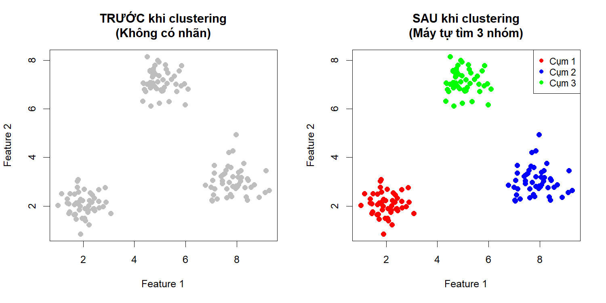

Bài 2: Unsupervised Learning - Phân cụm (Clustering)
================
Giảng viên: Lê Nhật Tùng
Tháng 3, 2026

## Mục tiêu học tập

- Hiểu Unsupervised Learning và vai trò của Clustering
- Nắm vững thuật toán K-Means và cách chọn K tối ưu
- Hiểu và áp dụng Hierarchical Clustering
- Sử dụng DBSCAN cho dữ liệu phức tạp
- Đánh giá chất lượng clustering
- Áp dụng vào bài toán thực tế

------------------------------------------------------------------------

## 2.1 Unsupervised Learning là gì?

### 2.1.1 Định nghĩa

**Unsupervised Learning (Học không giám sát)** là học từ dữ liệu **KHÔNG
có nhãn**.

**Đặc điểm:** - Chỉ có **input (X)**, không có output (y) - Mục tiêu:
Tìm **cấu trúc ẩn** trong dữ liệu - Không có “đáp án đúng” để so sánh

### 2.1.2 So sánh với Supervised Learning

| Khía cạnh    | Supervised Learning           | Unsupervised Learning        |
|--------------|-------------------------------|------------------------------|
| **Dữ liệu**  | Có nhãn (X, y)                | Không nhãn (X)               |
| **Mục tiêu** | Dự đoán y từ X                | Tìm patterns, cấu trúc       |
| **Ví dụ**    | Phân loại spam, Dự đoán giá   | Phân nhóm khách hàng         |
| **Đánh giá** | Accuracy, F1, RMSE            | Silhouette, Elbow, Inertia   |
| **Độ khó**   | Dễ đánh giá (có ground truth) | Khó đánh giá (không có nhãn) |

### 2.1.3 Các loại Unsupervised Learning

<!-- -->

**1. Clustering (Phân cụm)** - Nhóm các đối tượng tương tự vào cùng một
cụm - Ví dụ: K-Means, Hierarchical, DBSCAN

**2. Dimensionality Reduction (Giảm chiều)** - Giảm số lượng features,
giữ lại thông tin quan trọng - Ví dụ: PCA, t-SNE, UMAP

**3. Association Rules (Luật kết hợp)** - Tìm mối quan hệ giữa các
items - Ví dụ: Market Basket Analysis (người mua bia thường mua tã)

**4. Anomaly Detection (Phát hiện bất thường)** - Tìm các điểm dữ liệu
khác biệt - Ví dụ: Phát hiện gian lận, lỗi hệ thống

------------------------------------------------------------------------

## 2.2 Clustering là gì?

### 2.2.1 Định nghĩa

**Clustering (Phân cụm)** là nhóm các đối tượng **tương tự** vào cùng
một cụm.

**Mục tiêu:** - Các đối tượng **trong cùng cụm** có độ tương đồng cao -
Các đối tượng **khác cụm** có độ khác biệt cao

### 2.2.2 Ví dụ trực quan

``` r
set.seed(123)

# Tạo 3 nhóm dữ liệu rõ ràng
group1_x <- rnorm(50, mean = 2, sd = 0.5)
group1_y <- rnorm(50, mean = 2, sd = 0.5)

group2_x <- rnorm(50, mean = 8, sd = 0.6)
group2_y <- rnorm(50, mean = 3, sd = 0.6)

group3_x <- rnorm(50, mean = 5, sd = 0.5)
group3_y <- rnorm(50, mean = 7, sd = 0.5)

all_x <- c(group1_x, group2_x, group3_x)
all_y <- c(group1_y, group2_y, group3_y)

par(mfrow = c(1, 2))

# Trước khi clustering
plot(all_x, all_y, pch = 19, col = "gray", cex = 1.2,
     xlab = "Feature 1", ylab = "Feature 2",
     main = "TRƯỚC khi clustering\n(Không có nhãn)")

# Sau khi clustering
plot(all_x, all_y, pch = 19, cex = 1.2,
     col = c(rep("red", 50), rep("blue", 50), rep("green", 50)),
     xlab = "Feature 1", ylab = "Feature 2",
     main = "SAU khi clustering\n(Máy tự tìm 3 nhóm)")

legend("topright", 
       legend = c("Cụm 1", "Cụm 2", "Cụm 3"),
       col = c("red", "blue", "green"),
       pch = 19, cex = 0.9)
```

<!-- -->

``` r
par(mfrow = c(1, 1))
```

### 2.2.3 Ứng dụng thực tế

| Lĩnh vực | Ứng dụng | Mục đích |
|----|----|----|
| **Marketing** | Phân khúc khách hàng | Chiến lược marketing riêng cho từng nhóm |
| **E-commerce** | Gợi ý sản phẩm | Tăng doanh thu, cross-sell |
| **Y tế** | Phân nhóm bệnh nhân | Điều trị cá nhân hóa |
| **Sinh học** | Phân loại gen | Nghiên cứu di truyền |
| **Xử lý ảnh** | Phân đoạn ảnh | Computer Vision, object detection |
| **Mạng xã hội** | Phát hiện cộng đồng | Phân tích mạng lưới |
| **Tài chính** | Phát hiện gian lận | Nhóm giao dịch bất thường |

**Ví dụ cụ thể: Phân khúc khách hàng**

    Dữ liệu: 10,000 khách hàng với Age, Income, Spending

    Sau clustering → 4 nhóm:
    - Nhóm 1: Trẻ, thu nhập thấp, chi tiêu ít
      → Chiến lược: Sản phẩm giá rẻ, khuyến mãi mạnh
      
    - Nhóm 2: Trung niên, thu nhập cao, chi tiêu nhiều
      → Chiến lược: Sản phẩm cao cấp, chương trình VIP
      
    - Nhóm 3: Cao tuổi, thu nhập trung bình, chi tiêu ổn định
      → Chiến lược: Sản phẩm chất lượng, dịch vụ tốt
      
    - Nhóm 4: Đa dạng tuổi, thu nhập cao, chi tiêu thấp
      → Chiến lược: Kích thích tiêu dùng, ưu đãi đặc biệt

------------------------------------------------------------------------
